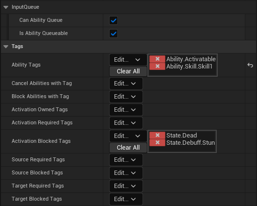
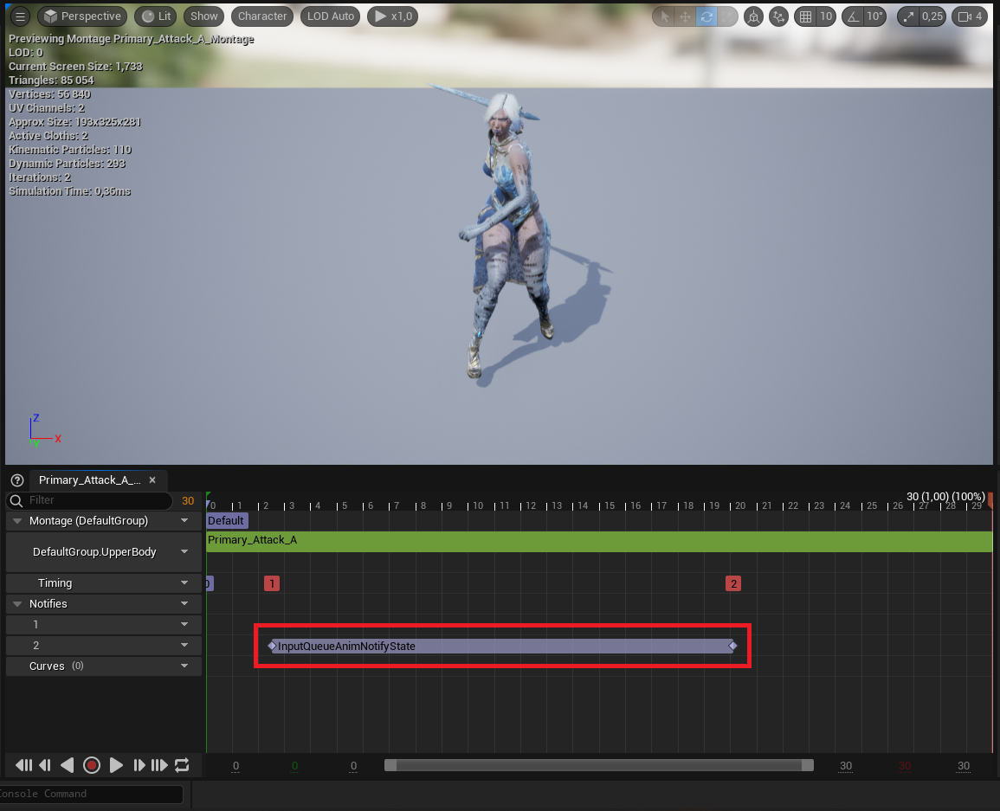

# GASInputQueue
This is an Unreal Engine 5.1 project offering an input queue system, implemented using the Gameplay Abilities plugin (https://github.com/tranek/GASDocumentation).

### Concept
If you have played any souls-like you have probably encountered this system - it makes it so when you activate an ability, such as a basic attack, you have a window of frames in which your first ability input is stored and then pushed once the window has ended. It helps to make the combat more fluid and responsive.

### Usage
Feel free to use this when making an RPG combat system.
The main point are UInputQueueAnimNotifyState, UInputQueueAbilitySystemComponent and UInputQueueGameplayAbility classes. The two latter are crafted to enable creating activatable abilities that can queue other and/or be queued themselves (Defined by two boolean properties). The former is a notify state that, when placed in your ability animation, stores the UGameplayAbilitySpec of the ability you're trying to cast while in the window and commits it, once the window has ended, provided that the current ability can queue and the planned ability can be queued.

### IF YOU HAVE ANY TROUBLE MAKING THIS WORK BE SURE TO CHECK MY HACKANDSLASHTEMPLATE REPO'S README.
 

Class defaults of UInputQueueGameplayAbility-derived blueprint classes. Be sure to also specify the ability input.

If an ability gets queued during this time window, once the anim notify ends the currently active ability get cancelled and the queued ability commits.

### Without Input Queue

https://user-images.githubusercontent.com/106023363/229921620-06fe912e-d455-4d94-ab8d-1e2d85b5f7cd.mp4

### With Input Queue

https://user-images.githubusercontent.com/106023363/229922264-30fc815b-ef0d-4092-8317-762fc1e8f2b8.mp4

Video quality reduced due to GitHub file size requirements. Better quality files available in repository.

Be sure to create abilities from your own, custom class and not from the default GameplayAbility class.

Have fun!

### License
BSD 2-Clause License

Copyright (c) 2023, Marcin Gałąska  
All rights reserved.

Redistribution and use in source and binary forms, with or without
modification, are permitted provided that the following conditions are met:

* Redistributions of source code must retain the above copyright notice, this
  list of conditions and the following disclaimer.

* Redistributions in binary form must reproduce the above copyright notice,
  this list of conditions and the following disclaimer in the documentation
  and/or other materials provided with the distribution.

THIS SOFTWARE IS PROVIDED BY THE COPYRIGHT HOLDERS AND CONTRIBUTORS “AS IS” AND ANY EXPRESS OR IMPLIED WARRANTIES, INCLUDING, BUT NOT LIMITED TO, THE IMPLIED WARRANTIES OF MERCHANTABILITY AND FITNESS FOR A PARTICULAR PURPOSE ARE DISCLAIMED. IN NO EVENT SHALL THE COPYRIGHT HOLDER OR CONTRIBUTORS BE LIABLE FOR ANY DIRECT, INDIRECT, INCIDENTAL, SPECIAL, EXEMPLARY, OR CONSEQUENTIAL DAMAGES (INCLUDING, BUT NOT LIMITED TO, PROCUREMENT OF SUBSTITUTE GOODS OR SERVICES; LOSS OF USE, DATA, OR PROFITS; OR BUSINESS INTERRUPTION) HOWEVER CAUSED AND ON ANY THEORY OF LIABILITY, WHETHER IN CONTRACT, STRICT LIABILITY, OR TORT (INCLUDING NEGLIGENCE OR OTHERWISE) ARISING IN ANY WAY OUT OF THE USE OF THIS SOFTWARE, EVEN IF ADVISED OF THE POSSIBILITY OF SUCH DAMAGE.
